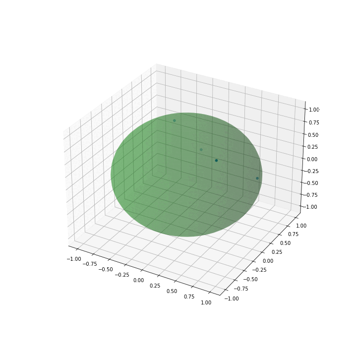
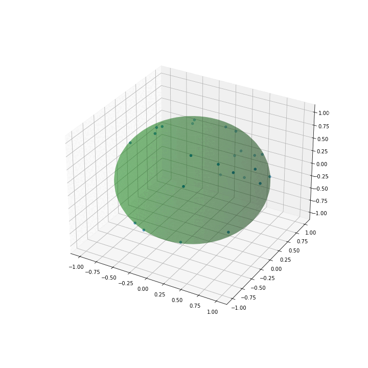
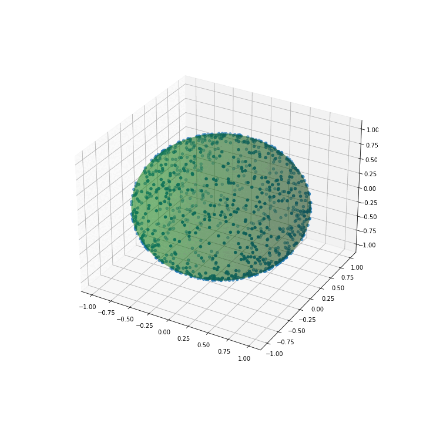

# SphericalRieszSearch
Minimizes Riesz energy for N point on a d-dimensional sphere using projected gradient descent.

<table>
<tr>
<td></td><td>
</tr>
<tr>
<td>N=4</td><td>N=25</td>
</tr>
<tr>
</td><td></td><td></td>
</tr>
<tr>
<td>N=50</td><td>N=1000</td>
</tr>
</table>

Dependencies
------------

SphericalRieszSearch involves the following Python libraries:

* Numpy 1.21.5
* Matplotlib 3.5.1
* Pytorch 1.10.2

An option has been included to leverage Pykeops for high N. 

* PyKeops 1.5

This option has additional requirements, but can be turned off by setting use_keops to false in Riesz.py

Licence
-------

This program is free software: you can redistribute it and/or modify it under 
the terms of the GNU General Public License as published by the Free Software 
Foundation, either version 3 of the License, or (at your option) any later 
version.

This program is distributed in the hope that it will be useful, but WITHOUT 
ANY WARRANTY; without even the implied warranty of MERCHANTABILITY or FITNESS 
FOR A PARTICULAR PURPOSE. See the GNU General Public License for more details.

You should have received a copy of the GNU General Public License along with 
this program. If not, see http://www.gnu.org/licenses/.
